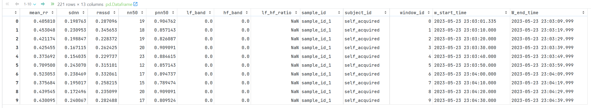

# sem-biosignals-ecg-feature-processing-api
(Fast)API Pipeline for the processing of heart rate data from raw ECG signals towards HRV features.

To-Do
---
* [-] Eigene Daten testen 
* [x] Pipeline in FastAPI überführen und Funktionen kapseln
* [x] „Windows schneiden“ Ablauf in Pipeline integrieren
* [ ] „Windows schneiden“ Funktion erweitern, sodass auch die Labels geschnitten werden
* [ ] Features verbessern
* [x] Kommentare vervollständigen (wenn noch nicht vorhanden)
---
* [x] Add description of the output data
* [ ] Add description of the pipeline framework
* [ ] Add description of the pipeline documentation
* [ ] Add description of the pipeline references
* [ ] Add description of the pipeline authors
* [ ] Add description of the pipeline license
* [ ] Add description of the pipeline contact
---

# Table of Contents
1. [Repo Structure](#repo-structure)
2. [Pipeline Framework](#pipeline-framework)
3. [Pipeline Description](#pipeline-description)
    1. [Input Data Form](#input-data-form)
    2. [Output Data Form](#output-data-form)
4. [Requirements](#requirenments)
5. [Setup and Usage](#setup-and-usage)
6. [Tutorial](#tutorial)
8. [Outlook](#outlook)
9. [Documentation](#documentation)
10. [References](#references)
11. [Authors](#authors)
12. [License](#license)
13. [Contact](#contact)

# Repo Structure
````
📦sem-biosignals-ecg-feature-processing-api 
 ┣ 📂data                    <-- Data used as input during development with Jupyter notebooks. 
 ┣ 📂docker                  <-- Folder containing the docker files.
 ┃ ┗ 📜Dockerfile            <-- Dockerfile for building the docker image.
 ┣ 📂models                  <-- Saved models during Development.
 ┣ 📂notebooks               <-- Jupyter Notebooks used in development.
 ┣ 📂src                     <-- The customized project packages containing all utility functions and source codes.
 ┣ 📜.gitignore              <-- Gitignore file. 
 ┣ 📜main.py                 <-- The final FastAPI App. 
 ┣ 📜README.md               <-- The top-level README for developers using this project. 
 ┗ 📜requirenments.txt       <-- The requirenments file for reproducing the environment, e.g. generated with 
                                 'pip freeze > requirenments.txt'.
````

# Pipeline Framework
*...TBD...Description about using FAstAPI...*

# Pipeline Description
This pipeline is designed to process ECG data from raw signals to HRV features. It is implemented as a FastAPI to be 
used inside an application. However, it is also designed to be possibly be used later on in a web application, where the 
user can upload ECG data and receive the HRV features. 

Short Overview:
* Input (plus device): *...TBD...*
* Output: *...TBD...*
* Input data form: JSON implementing ECGBatch and ECGSample models. See [below](#input-data-form) for more details. 
* Output data form: JSON implementing a Pandas DataFrame containing the HRV features for each window for each sample given in the 
batch. See [below](#output-data-form) for more details.

## Input Data Form
Examples for the Input are implemented in the code and can be seen when running the api via the /docs user interface. 
However, here is an overview of the Input model and its attributes, including their type, constraints and description.

This code defines two Pydantic input models, ECGSample and ECGBatch, for validating and processing data related to 
electrocardiogram (ECG) biosignals. 

**ECGBatch** is a model for representing a batch of ECG data from multiple subjects in an experiment. It has the 
following attributes:

| **ECGBatch**  | ****            | ****         | ****            | ****                                                                                                  |
|---------------|-----------------|--------------|-----------------|-------------------------------------------------------------------------------------------------------|
| **Parameter** | **Type**        | **Optional** | **Constraints** | **Description**                                                                                       |
| supervisor    | str             | False        | N/A             | Name of the supervisor who conducted the experiment.                                                  |
| record_date   | date            | False        | N/A             | Date on which the ECG data was recorded. If not provided, the current date is set as the default.     |
| samples       | list[ECGSample] | False        | N/A             | A list of ECGSample objects representing the results of the experiment for all subjects.              |
| configs       | dict or None    | True         | N/A             | A dictionary containing the configuration settings used during the experiment. Default value is None. |

**ECGSample** is a model for representing the results of a single subject in an ECG experiment. It has the following 
attributes:

| **ECGSample**     | ****                        | ****         | ****            | ****                                                                                                                                                                                                  |
|-------------------|-----------------------------|--------------|-----------------|-------------------------------------------------------------------------------------------------------------------------------------------------------------------------------------------------------|
| **Parameter**     | **Type**                    | **Optional** | **Constraints** | **Description**                                                                                                                                                                                       |
| sample_id         | UUID or None                | True         | N/A             | Unique ID of the sample. If not provided, a UUID is generated using uuid4.                                                                                                                            |
| subject_id        | str                         | False        | N/A             | ID of the subject for whom the ECG data was collected.                                                                                                                                                |
| timestamp_idx     | list[datetime]              | False        | min_items=2     | A list of timestamps at which the ECG data was recorded.                                                                                                                                              |
| ecg               | list[float]                 | False        | min_items=2     | A list of ECG signal data values recorded at each timestamp.                                                                                                                                          |
| label             | list[str] or None           | True         | min_items=2     | A list of labels corresponding to each timestamp in the timestamp_idx list. If not provided, a default list with the same length as timestamp_idx and ecg is generated with "undefined" as its value. |
|                   |                             |              |                 |                                                                                                                                                                                                       |
| Config            | Class configuration options | False        | N/A             | Additional options for the class configuration, such as defining an example value for the model.                                                                                                      |
| set_label_default | Validator function          | N/A          | N/A             | A function that sets a default value for the label list parameter.                                                                                                                                    |
| check_length      | Validator function          | N/A          | N/A             | A function that checks that all list parameters have the same length.                                                                                                                                 |

The models use Pydantic's validation features, such as Field and validator, to ensure that the input data meets certain 
requirements, such as the length of the timestamp_idx, ecg, and label lists being the same. The Config class in each 
model then includes an example which can be seen in the code and also in the interface as mentioned above. Pydantic 
also enables someone to use this example as default input to test the routes, so no effort is to be taken defining a 
new example.

## Output Data Form
The output data is a Pandas DataFrame containing the HRV features for each window for each sample given in the batch. This is then converted to a simple records JSON format. The DataFrame has the following columns: 

| **Column** | **Type** | **Description** |
|-----------|----------|-----------------|
| sample_id | str      | ID of the sample. |
| subject_id | str      | ID of the subject. |
| window_id | int      | ID of the window. |
| w_start_time | datetime      | Start time of the window. |
| w_end_time | datetime      | End time of the window. |
| mean_rr | float      | Mean RR interval in the window. |
| sdnn | float      | Standard deviation of the RR intervals in the window. |
| rmssd | float      | Root mean square of the successive differences of the RR intervals in the window. |
| nn50 | int      | Number of successive differences of the RR intervals in the window that are greater than 50 ms. |
| pnn50 | float      | Percentage of successive differences of the RR intervals in the window that are greater than 50 ms. |
| lf_band | float      | Power of the low frequency band in the window. |
| hf_band | float      | Power of the high frequency band in the window. |
| lf_hf_ratio | float      | Ratio of the low frequency band power to the high frequency band power in the window. |

**Dataframe Example:**



**Outlook:** Add more columns for the HRV features, such as:
* rr | list[float]      | List of RR intervals in the window.
* rpeaks | list[int]      | List of R-peak indices in the window.

# Requirenments
See in file [requirements.txt](requirements.txt)

# Setup and Usage
**Setup via Dockerfile (suggested)**
1. Install [Docker](https://docs.docker.com/engine/install/ubuntu/)
2. Clone the git repository:
    ````
    $ git clone https://github.com/nina-prog/sem-biosignals-ecg-feature-processing-api.git
    ````
3. Navigate to the cloned repository:
    ````
    $ cd sem-biosignals-ecg-feature-processing-api
    ````
2. Build Docker Image: a) Via Software Interface or b) via Command Line 
   * a) Software Interface:
   * *...TBD (.gif)...*
   * b) Command Line:
   * ````
     $ cd docker
     $ docker build . diarization
     ````
3. Start Docker Container: a) Via Software Interface or b) via Command Line
   * a) Software Interface:
   * *...TBD (.gif)...*
   * b) Command Line:
     * In foreground: 
        ````
        sudo docker run -p8000:8000 diarization:latest
       ````
     * Or in forebackground: 
       ````
       sudo docker run -d -p8000:8000 diarization:latest
       ````
--> Check FastAPI Docs at [localhost:8000/docs](localhost:8000/docs) or [localhost:8000/redoc](localhost:8000/redoc)

**Directly from the command line:**
1. Clone the git repository:
    ````
    $ git clone https://github.com/nina-prog/sem-biosignals-ecg-feature-processing-api.git
    ````
2. Navigate to the cloned repository:
    ````
    $ cd sem-biosignals-ecg-feature-processing-api
    ````
3. Create a virtual environment (python 3.10)  using the following command in the terminal: 
    ````
    $ python3 -m venv venv
    ````
4. Install requirements from requirements.txt using the following command in the terminal:
    ````
    $ pip install -r requirements.txt
    ````
5. Start the FastAPI app by running the following command in the terminal: 
    ````
    $ uvicorn main:app --reload --port 8000 --host 
    ````
--> Check FastAPI Docs at [localhost:8000/docs](localhost:8000/docs) or [localhost:8000/redoc](localhost:8000/redoc)

# Tutorial

# Outlook
* Add parameter "feature_selection" (str or list[EnumFeatures], default=all) to input class ECGBatch: select features 
which shuold be computed. *Example: list: [feature_x, feature_y, feature_z]; str: "HRV" -> computes defined "basic" HRV 
Features, "default" -> computes all features, "time-domain" -> computes only time domain features*
* Add new route "preprocess_ecg_data" to main.py: only execute preprocessing part of the application and do not compute 
the features.

# Documentation
* [FastAPI](https://fastapi.tiangolo.com/)
* [Pydantic](https://pydantic-docs.helpmanual.io/)

# References

# Authors

# License

# Contact